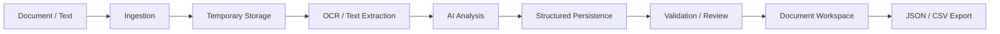
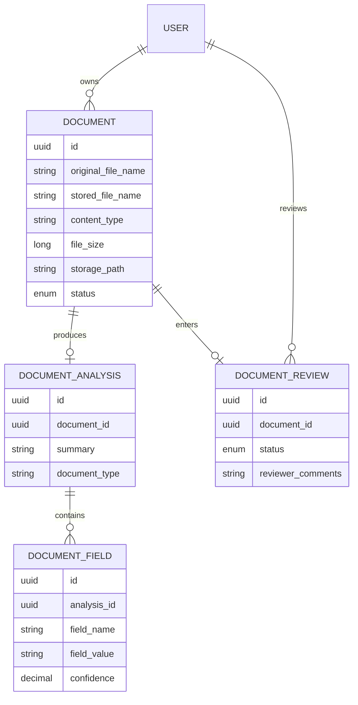

::: {align="center"}
# AccordIQ

### AI-Powered Document Intelligence

**Understand any document. Turn unstructured information into structured
insight.**

AccordIQ is a full-stack document intelligence platform designed to
ingest documents, extract their content through OCR, analyse them with
AI, structure the resulting information, surface risks and
recommendations, and provide a reviewable workspace for managing the
complete document lifecycle.

`<br />`{=html}

[](https://www.java.com/)
[](https://spring.io/projects/spring-boot)
[](https://nextjs.org/)
[](https://www.postgresql.org/)
[](https://ai.google.dev/)
[](LICENSE)

`<br />`{=html}

**[Live Application](https://accord-iq-delta.vercel.app)** ·
**[Repository](https://github.com/sumitdhara609/AccordIQ)**
:::

------------------------------------------------------------------------

## 01 · The idea

Documents contain information everywhere.

The problem is rarely the absence of information. The problem is
**understanding it consistently**.

A certificate, report, agreement, form, receipt, statement, or scanned
document may contain valuable information buried inside paragraphs,
tables, metadata, or images. Manually reading every document,
identifying important facts, comparing extracted information, and
preserving the result as structured data is slow and difficult to scale.

**AccordIQ was built around a simple idea:**

> Give the system a document.\
> Let it understand the document.\
> Return something a human can actually work with.

The platform combines document ingestion, OCR, AI analysis, structured
extraction, validation, review workflows, document management, and
export capabilities into one coherent experience.

------------------------------------------------------------------------

# 02 · What is AccordIQ?

AccordIQ is a full-stack **document intelligence platform** with a
modern web interface and a Java-based backend.

At its core, the platform transforms this:

``` text
Unstructured Document
        │
        ▼
   OCR / Text
        │
        ▼
   AI Analysis
        │
        ▼
Structured Information
        │
        ├── Summary
        ├── Document Type
        ├── Extracted Fields
        ├── Risks
        ├── Recommendations
        └── Review Status
```

into a workflow that can be inspected, reviewed, searched, exported, and
managed.

The project is intentionally designed as more than an AI wrapper. The AI
layer is one component inside a broader application architecture
responsible for authentication, persistence, document lifecycle
management, processing states, review operations, storage cleanup, error
handling, and API boundaries.

------------------------------------------------------------------------

# 03 · Product experience

## The first impression

AccordIQ opens with a deliberately restrained interface built around one
idea:

### Understand Any Document.

The landing experience supports both light and dark themes while keeping
the primary workflow immediately visible.

::: {align="center"}
``{=html}

`<br />`{=html}`<br />`{=html}

``{=html}
:::

------------------------------------------------------------------------

## From upload to understanding

The primary document workflow is designed to feel linear:

**Upload → Process → Understand → Review → Export**

The upload interface accepts documents through a focused drag-and-drop
workflow, while also providing a text-based analysis path.

::: {align="center"}
``{=html}
:::

Supported document inputs include:

-   PDF
-   DOCX
-   PNG
-   JPG
-   TXT

The backend currently enforces a configurable multipart upload limit,
with the application configuration set to **25 MB per file**.

------------------------------------------------------------------------

# 04 · Account & workspace

AccordIQ is designed around authenticated workspaces rather than a
completely anonymous document store.

Users can create an account and return to their workspace through
JWT-based authentication.

::: {align="center"}
``{=html}

`<br />`{=html}`<br />`{=html}

``{=html}
:::

Authentication is implemented in the Spring Boot application with
dedicated authentication services, JWT handling, security configuration,
password configuration, CORS configuration, and custom user-detail
components.

------------------------------------------------------------------------

# 05 · The workspace

Once authenticated, the user enters the AccordIQ workspace.

The dashboard is intentionally information-dense without becoming
visually noisy. It exposes the operational state of the document
pipeline at a glance.

::: {align="center"}
``{=html}
:::

The dashboard tracks document states including:

  State             Meaning
  ----------------- ---------------------------------------
  Uploaded          Document has been received
  Processing        Document is being analysed
  OCR Completed     OCR stage has completed
  Review Required   Human review is required
  Completed         Processing has completed successfully
  Failed            Processing could not be completed

Dashboard statistics are calculated from persisted document state and
include totals, documents uploaded today, processing documents,
completed documents, review-required documents, and failures.

------------------------------------------------------------------------

## Quick actions

The workspace also exposes the workflows most likely to be used
repeatedly:

-   Upload a document
-   Analyse text
-   Browse documents
-   Open the review queue
-   Inspect recent documents

::: {align="center"}
``{=html}
:::

This keeps the dashboard from becoming a passive analytics screen. It
acts as the user's **control surface for document work**.

------------------------------------------------------------------------

# 06 · Document intelligence pipeline

The central engineering idea behind AccordIQ is that document analysis
is a pipeline rather than a single AI request.



## Step 1 --- Ingestion

The frontend sends the selected document to the API.

The backend creates a document record containing information such as:

-   Original filename
-   Stored filename
-   Content type
-   File size
-   Storage path
-   Processing status

The document starts in the `UPLOADED` state.

------------------------------------------------------------------------

## Step 2 --- Temporary file handling

The physical upload is treated as a processing artifact.

The backend stores the file temporarily, processes it, and removes the
physical uploaded file in a `finally` block whether processing succeeds
or fails.

This separation is important:

``` text
Database record
       ≠
Temporary physical upload
```

The database preserves the document's application-level record and
analysis state, while the physical upload is used during processing.

------------------------------------------------------------------------

## Step 3 --- OCR

Image-based documents require text extraction before meaningful analysis
can occur.

AccordIQ integrates Tess4J/Tesseract for OCR processing and exposes
configurable OCR settings for:

-   Tesseract data path
-   Language
-   Engine mode
-   Page segmentation mode

------------------------------------------------------------------------

## Step 4 --- AI analysis

Extracted text is passed into the AI analysis layer.

AccordIQ uses Google's official Gemini Java SDK and keeps the model
configuration externalised through environment-backed application
properties.

The analysis layer can produce structured information such as:

-   Summary
-   Document type
-   Key extracted fields
-   Risks
-   Recommendations

The goal is not merely to generate prose. The goal is to turn the
document into a **usable representation**.

------------------------------------------------------------------------

## Step 5 --- Structured persistence

Analysis results are persisted separately from the document itself.

The application maintains dedicated concepts for:

``` text
Document
   │
   └── DocumentAnalysis
           │
           └── DocumentField
```

This allows the platform to retrieve a document's analysis and
individual extracted fields independently.

The document-detail service maps analysis results and extracted fields
into a dedicated response model rather than forcing the frontend to
understand database entities.

------------------------------------------------------------------------

## Step 6 --- Review

Not every extracted result should be treated as final simply because an
AI model produced it.

AccordIQ therefore includes a review domain with explicit review status
and reviewer comments.

The processing layer can mark a document as `REVIEW_REQUIRED`, and the
review API supports approval and rejection operations.

This creates a more responsible workflow:

``` text
AI produces information
          ↓
Application evaluates state
          ↓
Human can review
          ↓
Approved / Rejected
```

------------------------------------------------------------------------

# 07 · Analysis results

The analysis result is where the document becomes useful.

::: {align="center"}
``{=html}
:::

The result view presents the generated summary and structured document
information rather than returning a raw block of model output.

The application can also expose extracted field-level information with
confidence values, allowing the interface to distinguish between a
document's overall interpretation and individual extracted facts.

------------------------------------------------------------------------

## Risks & recommendations

The intelligence layer also has dedicated areas for potential risks and
recommendations.

::: {align="center"}
``{=html}
:::

These areas are intentionally separate from the summary so that a user
can move from:

**What does this document say?**

to:

**What should I pay attention to?**

without losing the underlying document context.

------------------------------------------------------------------------

# 08 · Document management

AccordIQ treats analysis as part of a document lifecycle rather than a
one-time interaction.

The documents workspace supports:

-   Document listing
-   Search
-   Status filtering
-   Document counts
-   Upload navigation
-   Individual document access
-   Document deletion

::: {align="center"}
``{=html}
:::

The backend repository supports status-based and filename-based
querying, while the dashboard uses the same persisted document state to
calculate workspace statistics.

------------------------------------------------------------------------

## Document detail

Each document has its own detail view where its metadata and analysis
can be inspected.

::: {align="center"}
``{=html}
:::

The detail workflow also exposes export operations and document
deletion.

AccordIQ supports:

-   JSON export
-   CSV export
-   Document deletion
-   Analysis inspection
-   Review continuation

------------------------------------------------------------------------

# 09 · Architecture

AccordIQ is organised as a two-application full-stack repository:

``` text
AccordIQ/
│
├── apps/
│   │
│   ├── web/                         # Next.js frontend
│   │   ├── app/
│   │   ├── components/
│   │   ├── hooks/
│   │   ├── services/
│   │   └── types/
│   │
│   └── api/                         # Spring Boot backend
│       └── src/main/java/com/accordiq/
│           ├── ai/
│           ├── auth/
│           ├── common/
│           ├── config/
│           ├── dashboard/
│           ├── document/
│           ├── documentanalysis/
│           ├── documentfield/
│           ├── review/
│           ├── role/
│           ├── security/
│           ├── storage/
│           └── user/
│
├── assets/
│   └── screenshots/
│
├── docs/
│
├── .github/
│
└── README.md
```

The backend is deliberately split into domain-oriented modules instead
of placing every service into a single generic package.

------------------------------------------------------------------------

# 10 · Backend architecture

The Spring Boot API follows a layered, domain-oriented structure:

``` text
Controller
    ↓
Service
    ↓
Repository
    ↓
PostgreSQL
```

with dedicated supporting layers for:

``` text
Security
Storage
OCR
AI
Validation
Exception Handling
Mapping
Configuration
```

### Major backend domains

  -----------------------------------------------------------------------
  Domain                              Responsibility
  ----------------------------------- -----------------------------------
  `auth`                              Registration, login and
                                      authentication workflows

  `security`                          JWT, user details, security
                                      configuration and access handling

  `user`                              User persistence and current-user
                                      operations

  `document`                          Document lifecycle and document
                                      APIs

  `documentanalysis`                  Persisted AI analysis

  `documentfield`                     Structured extracted fields

  `document` / `processing`           OCR + analysis orchestration

  `review`                            Human review workflow

  `dashboard`                         Workspace statistics and recent
                                      documents

  `storage`                           Temporary file storage and cleanup

  `ai`                                Gemini integration and analysis
                                      responses

  `common`                            Shared exceptions and
                                      application-level concerns
  -----------------------------------------------------------------------

------------------------------------------------------------------------

# 11 · Security model

AccordIQ uses JWT-based authentication.

The backend includes dedicated components for:

-   JWT generation and validation
-   JWT authentication filtering
-   Custom user details
-   User details service
-   Authentication entry points
-   Access-denied handling
-   Password configuration
-   CORS configuration
-   Security configuration

Document access is scoped to the authenticated user in the document
service layer.

This matters because document intelligence is inherently data-sensitive:
a user's documents should not become a globally readable collection
simply because they share the same database.

------------------------------------------------------------------------

# 12 · Data model

At the persistence layer, AccordIQ separates the primary document record
from its derived intelligence.

A simplified relationship looks like:



This separation keeps raw document metadata, generated analysis,
extracted fields, and human review state independently addressable.

------------------------------------------------------------------------

# 13 · Technology stack

## Frontend

-   **Next.js**
-   **React**
-   **TypeScript**
-   **Tailwind CSS**
-   Component-based application architecture
-   Client-side service and hook abstractions
-   Responsive light/dark interface

## Backend

-   **Java 21**
-   **Spring Boot 3.5.4**
-   Spring Web
-   Spring Security
-   Spring Data JPA
-   Spring Validation
-   Spring Actuator
-   SpringDoc / OpenAPI

## AI & document processing

-   **Google Gemini**
-   Google's official Java GenAI SDK
-   **Tess4J / Tesseract**
-   **Apache PDFBox**

## Data & persistence

-   **PostgreSQL**
-   **Hibernate / JPA**
-   **Flyway**

## Supporting infrastructure

-   JWT
-   MapStruct
-   Lombok
-   Maven
-   Vercel
-   Render
-   PostgreSQL-compatible managed database deployment

------------------------------------------------------------------------

# 14 · API surface

The backend exposes domain-oriented REST APIs.

Examples include:

``` text
/api/v1/auth
/api/v1/documents
/api/v1/reviews
```

The application also exposes OpenAPI/Swagger support for API exploration
and development.

The backend health surface is provided through Spring Boot Actuator.

------------------------------------------------------------------------

# 15 · File lifecycle & cleanup

One of the deliberate engineering decisions in AccordIQ is separating
**processing storage** from **application persistence**.

The upload flow is conceptually:

``` text
Upload
  │
  ▼
Temporary file
  │
  ▼
Document record
  │
  ▼
OCR / AI processing
  │
  ├───────────────┐
  ▼               ▼
Success          Failure
  │               │
  ▼               ▼
Persist result   Mark FAILED
  │               │
  └───────┬───────┘
          ▼
Remove temporary physical file
```

The cleanup occurs in a `finally` block, meaning the temporary physical
upload is removed after processing whether the operation succeeds or
fails.

This keeps the physical processing artifact from becoming an
uncontrolled long-term storage layer.

------------------------------------------------------------------------

# 16 · Error handling & reliability

AccordIQ was built through actual implementation and debugging rather
than a single uninterrupted happy path.

Several issues became useful engineering checkpoints during development.

### Database configuration

The backend initially failed when the datasource configuration was
incomplete.

The application was corrected to use PostgreSQL explicitly, with
environment-backed configuration and the appropriate runtime driver.

### JWT / application context failures

Authentication configuration and dependency wiring were validated
through Spring's application context and startup lifecycle.

### Foreign-key deletion failure

A particularly important failure occurred when deleting a document that
still had dependent analysis records.

PostgreSQL rejected the operation because `document_analyses` still
referenced the document:

``` text
documents
   ↑
document_analyses
```

The deletion workflow was corrected to explicitly remove dependent
records before deleting the parent:

``` text
DocumentField
      ↓
DocumentAnalysis
      ↓
DocumentReview
      ↓
Document
```

The service now performs the dependency-aware deletion inside a
transaction and flushes the relevant repositories in sequence.

This was not merely a UI bug. It exposed a real persistence-layer
constraint and resulted in a safer lifecycle implementation.

### Temporary upload cleanup

The processing flow also needed to guarantee that temporary uploaded
files did not remain on disk after processing. The cleanup path was
moved into guaranteed `finally` handling, while cleanup failures are
logged without hiding the original processing exception.

### Memory pressure during processing

Large document processing also exposed a Java heap-space failure in the
deployed environment.

That incident reinforced an important principle for document
intelligence systems:

> File size limits are not the same thing as processing memory
> requirements.

The platform therefore treats upload limits, OCR processing, AI payload
size, temporary storage, and JVM memory as separate operational
concerns.

------------------------------------------------------------------------

# 17 · Development journey

AccordIQ was planned as a **seven-week full-time build**, assuming
roughly eight focused hours per day.

The timeline below represents the intended engineering progression from
foundation to a complete production-minded application.

## Week 1 --- Foundation & architecture

**Goal:** establish the system before building features.

-   Repository structure
-   Frontend/backend separation
-   Spring Boot bootstrap
-   Next.js application foundation
-   Configuration strategy
-   Database connectivity
-   Initial domain boundaries
-   API conventions
-   Global exception strategy
-   Basic UI system

**Milestone:** both applications boot independently with a clear
architectural direction.

------------------------------------------------------------------------

## Week 2 --- Identity & security

**Goal:** establish authenticated workspaces.

-   User model
-   Registration
-   Login
-   Password handling
-   JWT implementation
-   Authentication filter
-   User details
-   Security configuration
-   CORS
-   Protected routes
-   Frontend authentication state

**Milestone:** users can securely enter and leave an AccordIQ workspace.

------------------------------------------------------------------------

## Week 3 --- Document ingestion

**Goal:** make documents first-class application entities.

-   Document entity
-   Document repository
-   Upload API
-   File validation
-   Temporary storage
-   Document statuses
-   Upload UI
-   Document list
-   Document detail
-   Delete workflow
-   JSON/CSV export foundation

**Milestone:** users can upload and manage real documents.

------------------------------------------------------------------------

## Week 4 --- OCR & AI processing

**Goal:** turn documents into intelligence.

-   Processing orchestration
-   PDF handling
-   Image handling
-   Tesseract integration
-   OCR configuration
-   Gemini integration
-   Prompt / response handling
-   Structured analysis
-   Extracted fields
-   Processing status transitions

**Milestone:** an uploaded document can move through the analysis
pipeline.

------------------------------------------------------------------------

## Week 5 --- Review & workspace intelligence

**Goal:** make AI results operationally useful.

-   Review domain
-   Review queue
-   Approval/rejection flow
-   Reviewer comments
-   Dashboard statistics
-   Recent documents
-   Search
-   Status filtering
-   Analysis result presentation
-   Risks
-   Recommendations

**Milestone:** AccordIQ becomes a complete document workspace rather
than a single analysis endpoint.

------------------------------------------------------------------------

## Week 6 --- Reliability & production hardening

**Goal:** make the system survive real usage.

-   Error handling
-   Temporary-file cleanup
-   Transaction boundaries
-   Dependency-aware deletion
-   Foreign-key failure resolution
-   Authentication edge cases
-   API validation
-   Actuator health
-   Deployment configuration
-   Environment variables
-   Build verification
-   Memory-pressure investigation

**Milestone:** the application behaves predictably beyond the happy
path.

------------------------------------------------------------------------

## Week 7 --- Product polish & release

**Goal:** turn the engineering system into a finished product.

-   UI refinement
-   Responsive behaviour
-   Light/dark theme
-   Navigation improvements
-   Empty states
-   Loading states
-   Error states
-   Export experience
-   README and documentation
-   Screenshots
-   Deployment verification
-   Final repository cleanup
-   Release validation

**Milestone:** a polished, documented, deployable AccordIQ release.

------------------------------------------------------------------------

# 18 · Design philosophy

AccordIQ intentionally avoids the visual language of a generic AI
dashboard.

The interface is built around a few principles:

### Precision

Information should have hierarchy. Important information should look
important.

### Simplicity

Complex processing should not require a complex interface.

### Continuity

Uploading, analysing, reviewing and managing documents should feel like
one workflow.

### Restraint

Colour is used to communicate state rather than decorate the interface.

### Accessibility

The interface supports both light and dark themes while retaining
consistent information hierarchy.

The product footer summarises the design philosophy:

> **Built with precision. Design with simplicity.**

`<br />`{=html}

::: {align="center"}
*by* **Sumit Dhara**

**AccordIQ · Document Intelligence**
:::

------------------------------------------------------------------------

# 19 · Local development

## Prerequisites

Before running AccordIQ locally, install:

-   Node.js
-   npm
-   Java 21
-   Maven Wrapper
-   PostgreSQL
-   Tesseract OCR
-   A Gemini API key

------------------------------------------------------------------------

## Clone the repository

``` bash
git clone https://github.com/sumitdhara609/AccordIQ.git
cd AccordIQ
```

------------------------------------------------------------------------

## Backend configuration

Create the required environment variables for the API.

Example:

``` env
DATABASE_URL=jdbc:postgresql://localhost:5432/accordiq
DATABASE_USERNAME=postgres
DATABASE_PASSWORD=your_password

GEMINI_API_KEY=your_gemini_api_key

JWT_SECRET_KEY=your_secure_secret
JWT_EXPIRATION=86400000
JWT_REFRESH_EXPIRATION=604800000

ACCORDIQ_STORAGE_LOCATION=uploads
ACCORDIQ_CORS_ALLOWED_ORIGINS=http://localhost:3000

OCR_TESSERACT_DATA_PATH=/path/to/tessdata
OCR_TESSERACT_LANGUAGE=eng
OCR_TESSERACT_ENGINE_MODE=1
OCR_TESSERACT_PAGE_SEGMENTATION_MODE=3
```

Do not commit secrets to Git.

------------------------------------------------------------------------

## Run the API

``` bash
cd apps/api
```

Windows:

``` powershell
.\mvnw.cmd spring-boot:run
```

macOS / Linux:

``` bash
./mvnw spring-boot:run
```

The API can then be accessed locally through the configured server port.

------------------------------------------------------------------------

## Run the frontend

``` bash
cd apps/web
npm install
npm run dev
```

The Next.js development server normally runs at:

``` text
http://localhost:3000
```

------------------------------------------------------------------------

# 20 · Testing

The backend uses Spring Boot's testing infrastructure and Spring
Security test support.

Run:

``` powershell
cd apps/api
.\mvnw.cmd test
```

Build verification:

``` powershell
.\mvnw.cmd clean
.\mvnw.cmd test
```

A successful build confirms compilation, test compilation, and the
configured Maven lifecycle.

The repository also keeps deployment-oriented build verification
separate from local development so that infrastructure-specific failures
can be isolated from application code.

------------------------------------------------------------------------

# 21 · Deployment

AccordIQ is split into independently deployable applications.

``` text
                 ┌──────────────────────┐
                 │      Vercel          │
                 │   Next.js Frontend   │
                 └──────────┬───────────┘
                            │
                            │ HTTPS / REST
                            ▼
                 ┌──────────────────────┐
                 │       Render         │
                 │   Spring Boot API    │
                 └──────────┬───────────┘
                            │
                            ▼
                 ┌──────────────────────┐
                 │     PostgreSQL       │
                 │   Managed Database   │
                 └──────────────────────┘
```

The frontend is deployed through Vercel, while the Spring Boot API is
packaged and deployed separately.

The backend build produces a Spring Boot executable JAR suitable for
containerised deployment.

------------------------------------------------------------------------

# 22 · Environment strategy

Configuration is externalised rather than hard-coded into application
source.

Important configuration groups include:

``` text
Database
Storage
OCR
Gemini
JWT
CORS
Actuator
Swagger
Logging
```

This allows the same application code to move between development and
deployment environments without changing source-level secrets or
infrastructure endpoints.

------------------------------------------------------------------------

# 23 · Project structure

``` text
AccordIQ/
│
├── .github/
│
├── apps/
│   │
│   ├── api/
│   │   ├── src/
│   │   │   ├── main/
│   │   │   │   ├── java/com/accordiq/
│   │   │   │   │   ├── ai/
│   │   │   │   │   ├── auth/
│   │   │   │   │   ├── common/
│   │   │   │   │   ├── config/
│   │   │   │   │   ├── dashboard/
│   │   │   │   │   ├── document/
│   │   │   │   │   ├── documentanalysis/
│   │   │   │   │   ├── documentfield/
│   │   │   │   │   ├── review/
│   │   │   │   │   ├── role/
│   │   │   │   │   ├── security/
│   │   │   │   │   ├── storage/
│   │   │   │   │   └── user/
│   │   │   │   └── resources/
│   │   ├── pom.xml
│   │   └── mvnw / mvnw.cmd
│   │
│   └── web/
│       ├── app/
│       ├── components/
│       ├── hooks/
│       ├── services/
│       ├── types/
│       └── package.json
│
├── assets/
│   └── screenshots/
│       ├── 01-landing-light.png
│       ├── 02-landing-dark.png
│       ├── 03-document-upload.png
│       ├── 04-create-account.png
│       ├── 05-sign-in.png
│       ├── 06-dashboard.png
│       ├── 07-dashboard-quick-actions.png
│       ├── 08-document-analysis-processing.png
│       ├── 09-document-analysis-result.png
│       ├── 10-risks-recommendations.png
│       ├── 11-documents-management.png
│       └── 12-document-detail-analysis.png
│
├── docs/
│
└── README.md
```

------------------------------------------------------------------------

# 24 · Engineering principles

AccordIQ was built with the intention of remaining understandable as the
system grows.

### Separation of concerns

Storage, OCR, AI, persistence, authentication, review, and presentation
are separated into their own application concerns.

### Explicit domain boundaries

The backend uses domain-oriented packages instead of treating the API as
one large service.

### DTO boundaries

API responses use dedicated DTOs rather than exposing persistence
entities directly.

### Transactional integrity

Operations that affect dependent records are handled transactionally.

### Failure-aware workflows

Processing failures are represented through document state rather than
silently disappearing.

### Cleanup guarantees

Temporary resources are cleaned up even when downstream processing
fails.

### Configuration externalisation

Secrets and environment-specific infrastructure values remain outside
source code.

### Human review

AI output can enter an explicit review workflow rather than
automatically becoming unquestioned final truth.

------------------------------------------------------------------------

# 25 · What makes AccordIQ different?

AccordIQ is not built around the question:

> "How do I call an AI model?"

It is built around a more useful question:

> **"What should happen to a document before, during, and after AI
> understands it?"**

That changes the architecture.

The AI model is only one stage.

The complete system has to deal with:

``` text
Identity
   ↓
Ownership
   ↓
Ingestion
   ↓
Storage
   ↓
OCR
   ↓
AI
   ↓
Structured Data
   ↓
Validation
   ↓
Review
   ↓
Export
   ↓
Lifecycle Management
```

That is the engineering problem AccordIQ attempts to solve.

------------------------------------------------------------------------

# 26 · Roadmap

AccordIQ's current architecture leaves room for several future
directions.

### Near term

-   More robust processing for larger documents
-   More granular analysis controls
-   Better processing progress visibility
-   Expanded review workflows
-   More document formats
-   Improved automated testing coverage

### Medium term

-   Batch document processing
-   Document comparison
-   Version history
-   Advanced search
-   Confidence-based review queues
-   Custom extraction schemas
-   More sophisticated document classification

### Long term

-   Workspace-level collaboration
-   Role-based review permissions
-   Enterprise document workflows
-   Pluggable OCR providers
-   Pluggable AI providers
-   Event-driven processing
-   Queue-backed asynchronous document processing
-   Observability and processing analytics

The architecture is intentionally structured so these capabilities can
be introduced without rewriting the entire platform.

------------------------------------------------------------------------

# 27 · Development notes

AccordIQ was developed as a hands-on engineering project with an
emphasis on understanding the system from the persistence layer to the
user interface.

The project deliberately includes the lessons that emerge from building
a real application:

-   A build can succeed while a runtime workflow still fails.
-   A database constraint can reveal an architectural problem in a
    service method.
-   Temporary files require explicit lifecycle management.
-   AI integration introduces operational considerations beyond prompt
    design.
-   Authentication affects data access throughout the application.
-   A polished UI still depends on reliable backend state transitions.
-   Production deployment exposes problems that local development may
    hide.

The result is not just a demonstration of a technology stack.

It is a record of building, breaking, investigating, fixing, and
refining a complete software system.

------------------------------------------------------------------------

# 28 · Screenshots

The repository contains a curated visual record of AccordIQ under:

``` text
assets/screenshots/
```

The screenshots intentionally cover the product journey:

``` text
Landing
   ↓
Authentication
   ↓
Upload
   ↓
Dashboard
   ↓
Processing
   ↓
Analysis
   ↓
Risks & Recommendations
   ↓
Document Management
   ↓
Document Detail
```

They are part of the project's documentation, not merely decorative
assets.

------------------------------------------------------------------------

# 29 · Closing

AccordIQ started with a simple observation:

**Documents are everywhere, but understanding them should not require
reading every line manually.**

The project brings together:

**OCR + AI + structured extraction + review + document management**

inside a single full-stack system.

It is designed to be clear enough to use, structured enough to extend,
and engineered enough to learn from.

`<br />`{=html}

::: {align="center"}
### Built with precision. Design with simplicity.

*by* **Sumit Dhara**

**AccordIQ · Document Intelligence**

`<br />`{=html}

[Live Application](https://accord-iq-delta.vercel.app) · [GitHub
Repository](https://github.com/sumitdhara609/AccordIQ)
:::

------------------------------------------------------------------------

::: {align="center"}
**AccordIQ**

*Understand Any Document.*
:::
