<div align="center">

# AccordIQ

### AI-Powered Document Intelligence

**Understand any document. Turn unstructured information into structured insight.**

<p>
  <strong>Designed & developed by Sumit Dhara</strong>
</p>

<p>
  <a href="https://accord-iq-delta.vercel.app">Live Application</a>
</p>

<p>
  
  
  
  
  
</p>

</div>

---

> ## ✦ Give it a document. Get the useful result.
>
> **No account required to start.**
>
> Upload a document or paste text, let AccordIQ understand it, and get a structured result.
>
> **Create an account only when you want to keep the work.**

---

## The Idea

Documents are full of information.

The difficult part is finding the information that actually matters.

A certificate, agreement, report, form, statement, receipt or scanned document can contain useful facts across paragraphs, tables, images and inconsistent layouts. Reading everything manually is possible. Turning that information into something structured, searchable and reusable is where the real friction begins.

**AccordIQ is built to remove that friction.**

It brings document ingestion, OCR, AI-assisted understanding, structured extraction, risks, recommendations, review workflows, persistence and export into one focused experience.

The goal is deliberately simple:

**Bring the document → understand the document → use the result.**

---

## ⚡ Start instantly

AccordIQ separates **understanding a document** from **storing a document**.

| If you need to… | You can… |
|---|---|
| Quickly understand one document | **Analyse it without creating an account** |
| Return to your documents later | **Create an account and use the workspace** |
| Manage multiple documents | **Use search, status filters and document management** |
| Keep an analysis outside the application | **Export the result as JSON or CSV** |

This keeps the first interaction lightweight while still providing a persistent workspace for people who need one.

### ✦ The AccordIQ promise

**Analyse first. Account later. Store only when it matters.**

The product is designed around a simple user question: *“I have a document. Can you help me understand it?”* AccordIQ aims to answer that question before introducing unnecessary friction.

---

## 🧠 What AccordIQ does

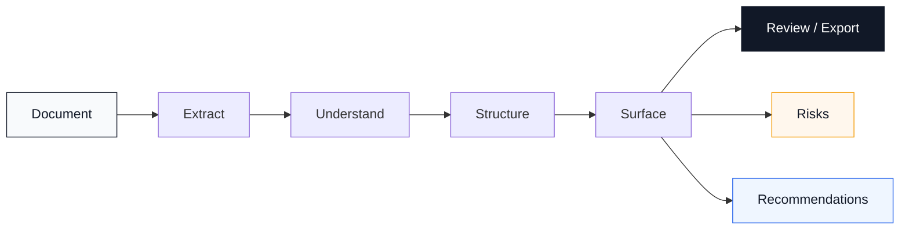

The platform is designed to move beyond raw OCR or a generic model response.

It aims to turn a document into information a person can actually work with:

- **Summary** — what the document is saying
- **Structured information** — important extracted facts
- **Document context** — what kind of document it is and what it contains
- **Risks** — areas that may deserve attention
- **Recommendations** — useful next steps when the analysis supports them
- **Review state** — where the document sits in its lifecycle
- **Export** — take the result with you

---

## 📄 The experience

### 1. Bring a document

Upload a supported document through the focused drag-and-drop workflow, or switch to text input when you already have the content.

**Supported inputs**

`PDF` · `DOCX` · `PNG` · `JPG` · `TXT`

<p align="center">
  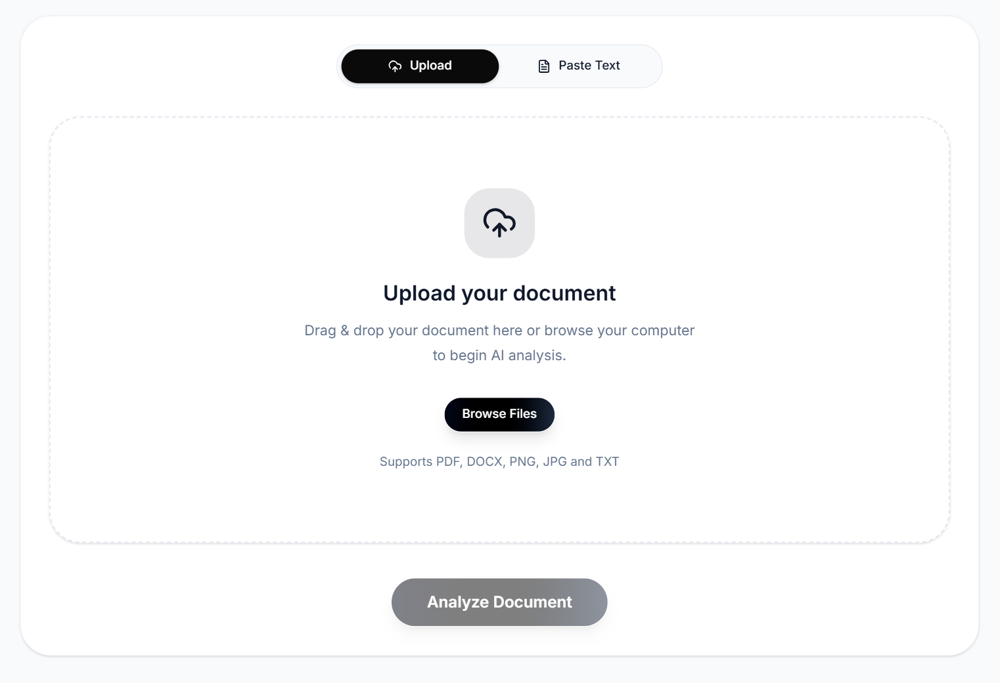
</p>

---

### 2. Let AccordIQ work

The analysis workflow deliberately exposes progress rather than making the interface feel frozen while the document is being processed.

<p align="center">
  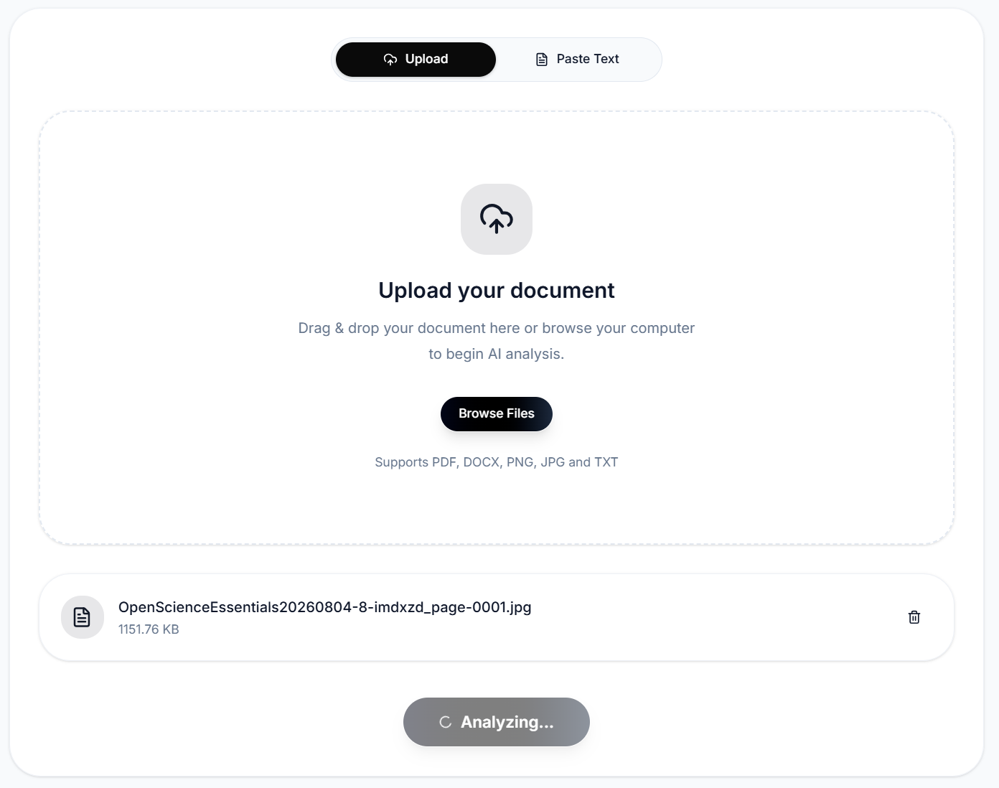
</p>

---

### 3. Get the result

The important moment is not the AI call.

It is the point where the document becomes understandable.

<p align="center">
  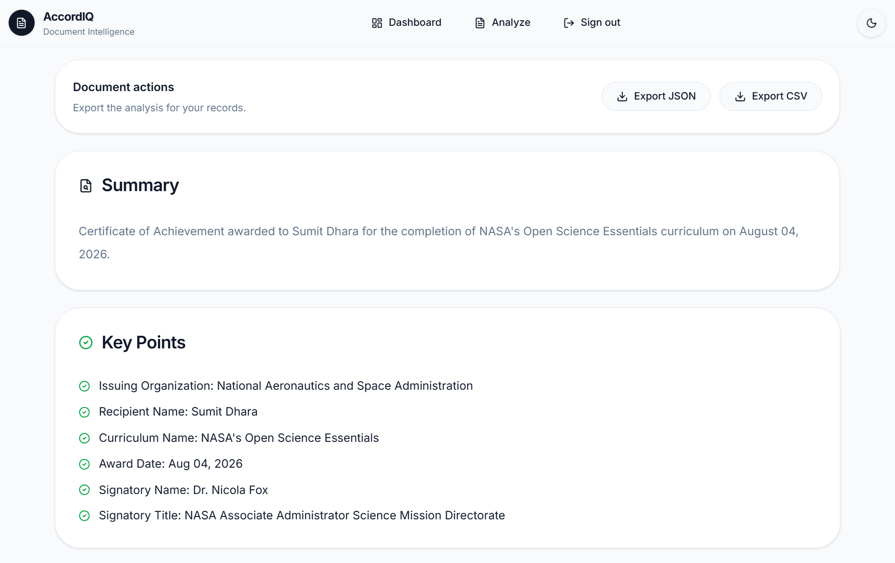
</p>

The result experience is designed around a human-readable hierarchy instead of one large block of generated text.

**Understand first. Inspect next. Act when necessary.**

---

### 4. See what deserves attention

Risks and recommendations have their own space so they do not disappear inside the summary.

<p align="center">
  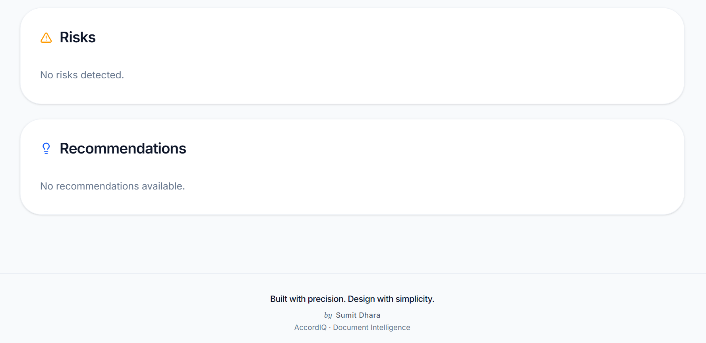
</p>

The intended reading flow becomes:

> **What is this? → What does it contain? → What should I notice? → What should I do?**

---

## 🎨 A deliberately restrained interface

AccordIQ does not try to make document intelligence look complicated.

The interface is intentionally clean, spacious and information-focused.

### Light / dark experience

<p align="center">
  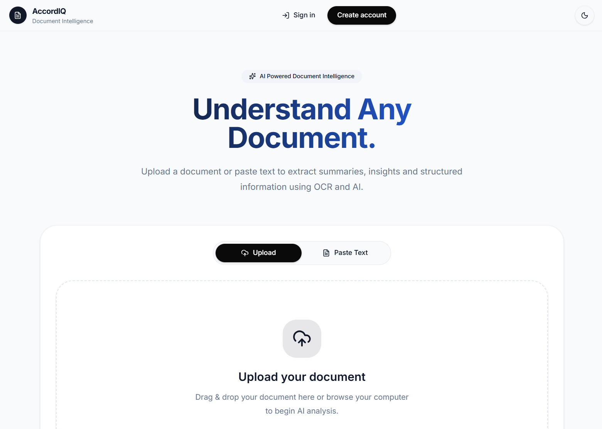
  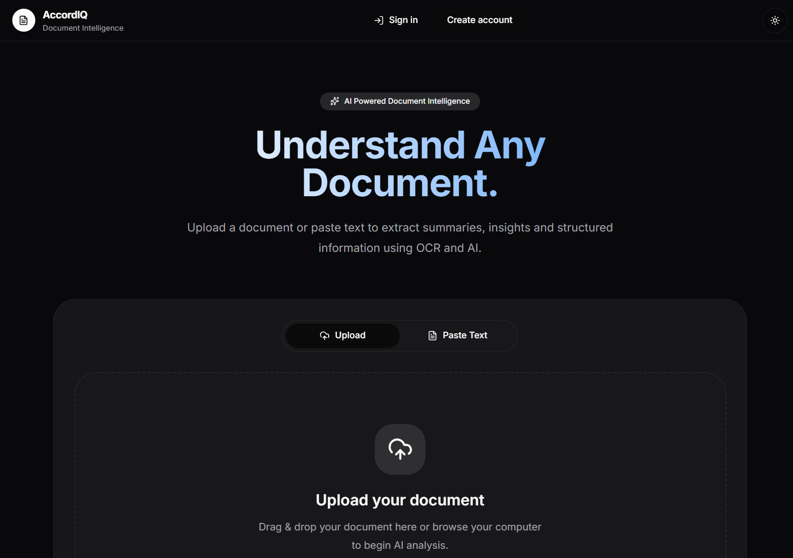
</p>

The first screen keeps the core promise visible:

### **Understand Any Document.**

No unnecessary dashboard appears before the user needs one.

---

## 🔐 A workspace when you need it

The product has two natural modes.

**Quick understanding**  
Analyse a document and get the useful result.

**Persistent work**  
Create an account when you want documents and analyses to remain part of a workspace.

<p align="center">
  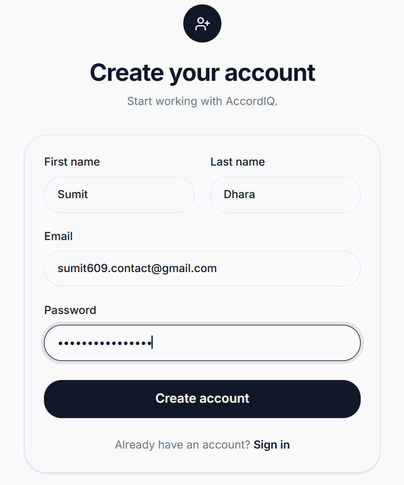
  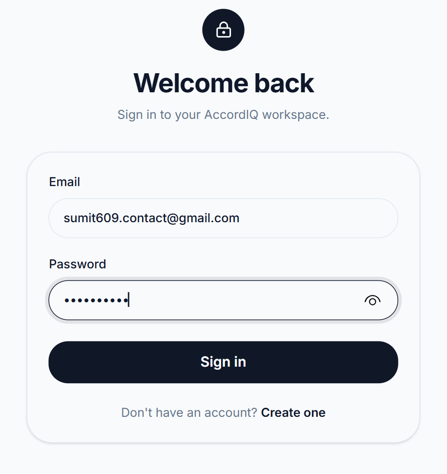
</p>

Authentication is implemented in the Spring Boot backend with JWT-based authentication and dedicated security components.

---

## 🗂️ Your document workspace

Once authenticated, AccordIQ becomes more than a one-time analysis tool.

The dashboard acts as the **control surface for document work**.

<p align="center">
  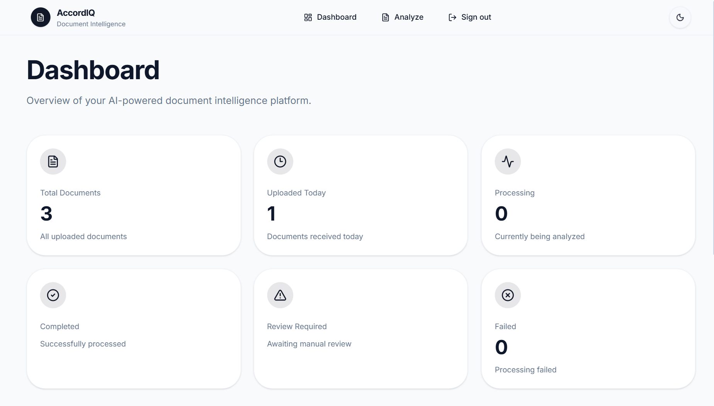
</p>

It brings the operational state of the workspace into one view:

`Total` · `Uploaded Today` · `Processing` · `Completed` · `Review Required` · `Failed`

### Quick actions

The workflows most likely to be repeated stay close to the surface:

**Upload Document · Analyse Text · Documents · Review Queue**

<p align="center">
  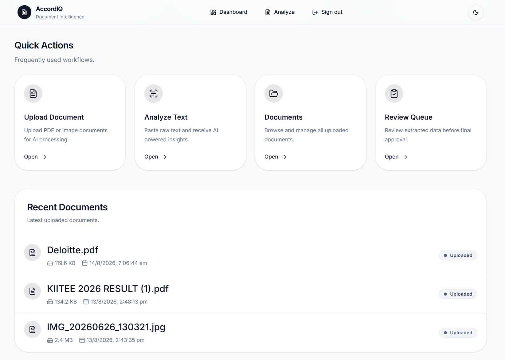
</p>

Recent documents are surfaced alongside the actions so returning to the product feels immediate rather than administrative.

---

## 📚 Documents have a lifecycle

AccordIQ treats analysis as part of a document lifecycle rather than a single disposable interaction.

The authenticated workspace supports:

**Search** · **Status filtering** · **Document counts** · **Individual document access** · **Deletion**

<p align="center">
  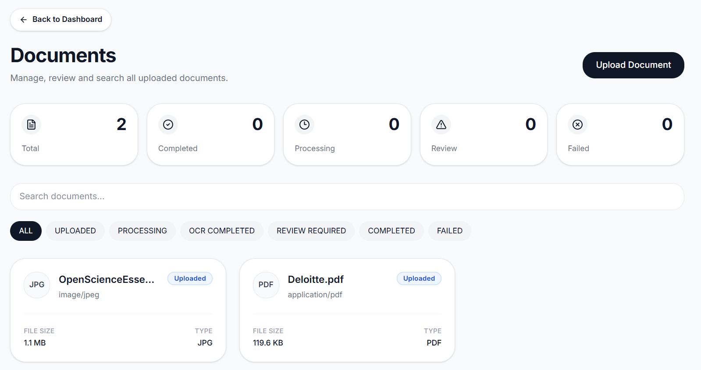
</p>

Each document can then be opened in its own detail view.

<p align="center">
  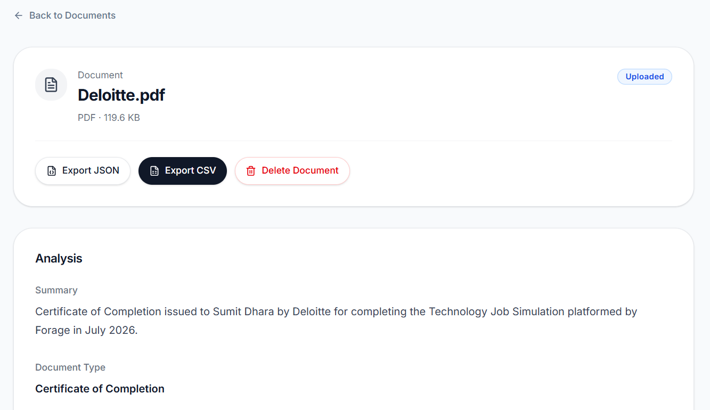
</p>

Document-level actions include analysis inspection and export operations.

---

## 🏗️ Built as a real full-stack system

AccordIQ is intentionally more than an AI endpoint wrapped in a web page.

The application has a dedicated frontend, backend API, persistence layer, authentication system and document-intelligence workflow.

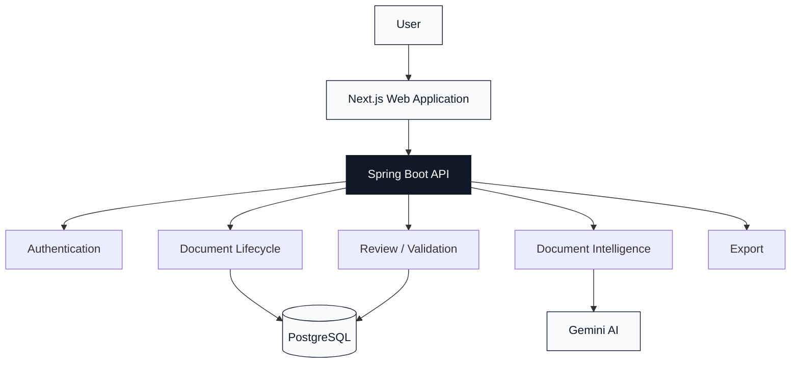

### The relationship at the centre

The persisted model is designed around the relationship between users, documents, analyses and reviews.

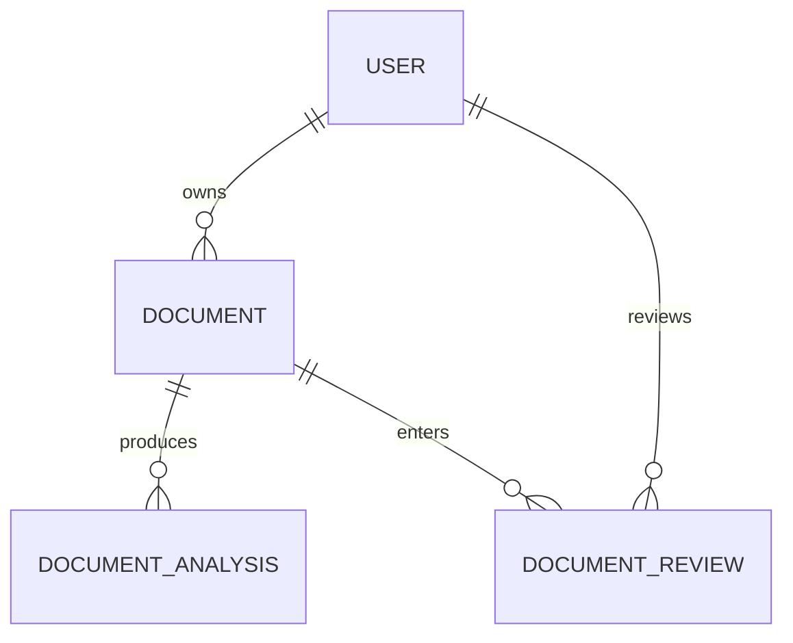

This gives the platform a foundation for treating a document as a continuing piece of work rather than an isolated request.

---

## 🎯 Designed around the user

AccordIQ is not built around the assumption that every visitor wants another dashboard, another account and another workflow to learn.

It is built around the document.

**If you need an answer, get the answer. If you need a workspace, create one.**

That distinction keeps the first interaction lightweight while giving returning users the structure they need to manage documents over time.

---

## 🧩 Technology stack

| Layer | Technology |
|---|---|
| Frontend | Next.js |
| Backend | Java 21 |
| API | Spring Boot 3.5.4 |
| Database | PostgreSQL |
| Authentication | JWT |
| Intelligence | Gemini AI |
| Document processing | OCR / extraction workflow |
| Styling | Tailwind CSS |
| Build | Maven |
| Deployment | Vercel |

Gemini AI powers a core part of the intelligence layer, helping AccordIQ move from extracted content toward useful, structured understanding.

The important distinction is simple: **Gemini is a component inside AccordIQ. The product is the workflow built around that intelligence.**

---

## 🧱 Engineering foundation

The backend is organised around focused domains instead of one large application package.

```text
apps/
├── api/
│   └── src/main/java/com/accordiq/
│       ├── ai/
│       ├── analysis/
│       ├── audit/
│       ├── auth/
│       ├── common/
│       ├── config/
│       ├── dashboard/
│       └── document/
│
└── web/
    ├── app/
    │   ├── documents/
    │   ├── login/
    │   ├── ocr/
    │   ├── register/
    │   ├── review/
    │   └── upload/
    │
    └── components/
        └── analyze/
```

The current structure is intentionally modular so authentication, document processing, analysis, review, dashboard behaviour and presentation can evolve without becoming one tightly coupled feature.

### Inside the document domain

```text
document/
├── controller/
├── dto/
│   ├── request/
│   └── response/
├── entity/
├── enums/
├── processing/
├── repository/
└── service/
```

The aim is straightforward:

> **Keep complexity inside the architecture so the user experience can stay simple.**

---

## 🛠️ Engineering principles

AccordIQ is being developed with long-term maintainability in mind.

**Separation of concerns**  
Each major responsibility has a clear home.

**Domain-oriented organisation**  
Features are grouped around business responsibilities rather than arbitrary technical layers.

**API boundaries**  
The web application communicates with the backend through explicit API contracts.

**Security by design**  
Authentication, password handling, JWT processing and CORS configuration are treated as backend responsibilities.

**Persistence with purpose**  
Documents and their lifecycle states provide the foundation for the authenticated workspace.

**Testability**  
The architecture is being kept modular so individual services and workflows can be tested without depending on the entire application.

---

## 🔄 The product loop

At a glance, the whole experience is intentionally simple:

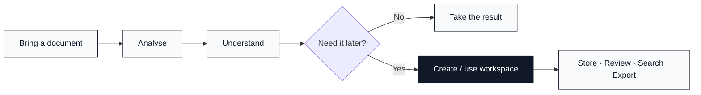

This is the product philosophy in one diagram:

**Use it quickly. Keep it when it matters.**

---

## 🚀 Run locally

### Requirements

- Java 21
- Node.js
- npm
- PostgreSQL
- Git

### Clone

```bash
git clone https://github.com/sumitdhara609/AccordIQ.git
cd AccordIQ
```

### Backend

macOS / Linux:

```bash
cd apps/api
./mvnw spring-boot:run
```

Windows:

```powershell
cd apps/api
.\mvnw.cmd spring-boot:run
```

### Frontend

```bash
cd apps/web
npm install
npm run dev
```

Configure database, authentication and AI-related values through your local environment/configuration.

**Never commit real credentials, database passwords, JWT secrets or API keys.**

---

## 🌐 Try AccordIQ

<div align="center">

**[Launch the live application →](https://accord-iq-delta.vercel.app)**

</div>

---

## 🧭 Where AccordIQ is going

AccordIQ is being built as a long-term document-intelligence platform.

The current foundation establishes the core product loop:

**ingest → analyse → understand → review → manage → export**

The architecture is intentionally being built so that deeper extraction, validation, richer review workflows, broader document support, stronger search and additional intelligence capabilities can be added without rebuilding the product from scratch.

The important thing is not to ship every idea at once.

It is to build the foundation correctly enough that the next idea has somewhere solid to live.

---

## Development Workflow

AccordIQ follows a modular development workflow designed to keep
document ingestion, analysis, validation, review, and export
responsibilities clearly separated.

Changes are introduced through focused branches and pull requests,
allowing individual parts of the platform to evolve independently
while preserving the stability of the development branch.

---

## 🤝 Contributing

AccordIQ is an evolving project and thoughtful technical feedback is welcome.

For a bug, improvement or feature proposal:

1. Open an issue.
2. Explain the problem or proposed change.
3. Include reproduction steps where relevant.
4. Keep the change aligned with the existing architecture and product direction.

---

## 📄 License

AccordIQ is released under the **MIT License**.

See the [MIT License](https://github.com/sumitdhara609/AccordIQ?tab=MIT-1-ov-file) for the complete license text.

---

<div align="center">

### Built with precision. Designed with simplicity.

<br />

**AccordIQ** is not built to make document intelligence look complicated.

It is built to make the **result feel effortless.**

<br />

<table>
  <tr>
    <td align="center">
      <strong>Designed & Developed by</strong><br />
      <a href="https://www.linkedin.com/in/sumit-dhara609/">
        <strong>Sumit Dhara</strong>
      </a>
    </td>
    <td align="center">
      <strong>Product</strong><br />
      AccordIQ · Document Intelligence
    </td>
    <td align="center">
      <strong>License</strong><br />
      <a href="https://github.com/sumitdhara609/AccordIQ?tab=MIT-1-ov-file">
        MIT License
      </a>
    </td>
  </tr>
</table>

<br />

<a href="https://accord-iq-delta.vercel.app">
  
</a>
&nbsp;
<a href="https://www.linkedin.com/in/sumit-dhara609/">
  
</a>

<br />
<br />

<sub>
A long-term flagship project — built one document workflow at a time.
</sub>

<br />

<sub>
<strong>Understand.</strong> &nbsp;·&nbsp;
<strong>Structure.</strong> &nbsp;·&nbsp;
<strong>Review.</strong> &nbsp;·&nbsp;
<strong>Act.</strong>
</sub>

</div>
